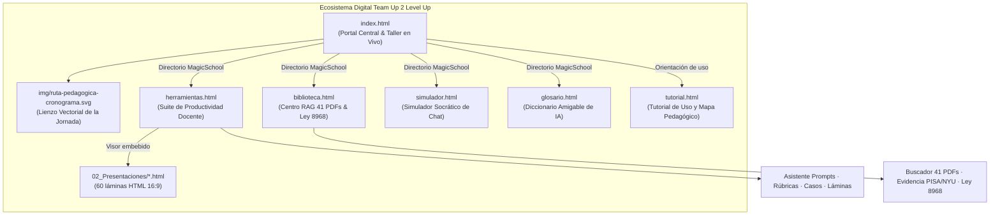
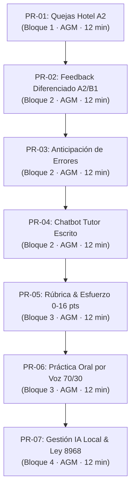

# MASTER CONTROL & ARCHITECTURAL SPECIFICATION
## Proyecto: *Team Up 2 Level Up: Inteligencia Artificial en la Enseñanza del Inglés Técnico*
### Instituto Nacional de Aprendizaje (INA) · Núcleo Comercio y Servicios · Subsector de Idiomas
**Fecha de la Jornada Oficial:** 6 de octubre de 2026  
**Facilitación académica integral:** **Agustín Gómez Meléndez** (UNED / UCR) · [ORCID: 0000-0002-7886-0740](https://orcid.org/0000-0002-7886-0740)
**Asesoría académica:** **Hannia León Fuentes** (UCR / PROTEA)
**Versión del Sistema:** 2.5 (Modular Multi-Página · Design System Lovable/MagicSchool · RAG 41 Docs · SVG Roadmap · Ley 8968)  
**Licencia de Obra:** Creative Commons Atribución 4.0 Internacional ([CC BY 4.0](https://creativecommons.org/licenses/by/4.0/))  
**Documento Generado:** 28 de septiembre de 2026 (19:35 UTC-6)  
**Última actualización arquitectónica:** 29 de septiembre de 2026 (integración de presentaciones HTML)

---

## 📋 1. Propósito y Audiencia del Documento

Este archivo constituye el **núcleo de control maestro, bitácora de desarrollo y manual de arquitectura** de la plataforma web del taller. Su propósito es garantizar la **total transparencia, trazabilidad técnica y transferibilidad pedagógica** para cualquier docente, diseñador curricular, administrador técnico del INA o modelo de lenguaje (LLM) que requiera auditar, mantener, desplegar o extender esta solución en el futuro.



---

## 🏛️ 2. Arquitectura de la Solución (Multi-Page Architecture)

### 2.1 Justificación del Desacoplamiento Arquitectónico
Originalmente, el portal operaba como una SPA (*Single Page Application*) monolítica de más de 115,000 bytes. Al concentrar el Asistente de Prompts de 5 componentes, el Probador de Rúbricas analíticas (0-16 pts), los 8 casos ocupacionales técnicos, el visor de presentaciones (60 láminas HTML verificadas en los cuatro bloques), 41 fichas documentales del corpus RAG, las 7 prácticas activas conducidas y la normativa de gobernanza, se generaba una **fatiga visual y cognitiva severa** en docentes con baja o mediana alfabetización digital.

La versión 2.5 resolvió este problema adoptando una **arquitectura multi-página modular y desacoplada** inspirada en los estándares de **Lovable Cohort** y **MagicSchool.ai**:

| Archivo | Rol en el Ecosistema | Componentes Principales | Enlace |
| :--- | :--- | :--- | :--- |
| **`index.html`** | Portal Principal, Hub de Inicio y Taller en Vivo | Hero Lovable con métricas flotantes, Directorio MagicSchool de 7 tarjetas, cronograma, selector de las 7 prácticas, temporizadores, cuaderno local acumulativo, avisos para Teams y Plan B modal. | [index.html](index.html) |
| **`herramientas.html`** | Suite Pedagógica de Productividad | Segmented Control Pills con 4 herramientas: 1) Asistente de Prompts con 5 componentes (`#builder`), 2) Probador de Rúbricas con modalidad cuantitativa 0-16 y modalidad cualitativa sin nota (`#rubric`), 3) Banco de Casos Ocupacionales (`#cases`), 4) Visor de Presentaciones HTML (`#slides`) con pantalla completa, enlace independiente, notas y navegación sincronizada. | [herramientas.html](herramientas.html) |
| **`02_Presentaciones/*.html`** | Presentaciones proyectables | Bloques 1 a 4 en HTML 16:9 (18, 18, 14 y 10 láminas), con notas, fuentes, vista general, navegación táctil/teclado e impresión. | Acceso desde `herramientas.html#slides` o apertura independiente. |
| **`biblioteca.html`** | Centro de Evidencia Científica & RAG | Segmented Control Pills con 3 módulos: 1) Corpus RAG de 41 PDFs con buscador reactivo por facetas (`#documents`), 2) Evidencia empírica (`#evidence`), 3) Marco de Gobernanza Ley 8968 y Compromiso (`#closing`). | [biblioteca.html](biblioteca.html) |
| **`simulador.html`** | Entorno Práctico de Interacción | Chatbot interactivo de práctica escrita y tutoría socrática para recepcionistas de hotel (A2), con andamiaje lingüístico, manejo de español y modo de voz. | [simulador.html](simulador.html) |
| **`glosario.html`** | Diccionario Terminológico Amigable | 18 términos esenciales de IA explicados mediante analogías cotidianas del aula y buscador en tiempo real. | [glosario.html](glosario.html) |
| **`tutorial.html`** | Tutorial de Uso y Mapa Pedagógico | Recorrido guiado de cinco pasos, diagrama SVG navegable, rutas por necesidad, explicación de servicios y acceso directo a cada sección. | [tutorial.html](tutorial.html) |
| **`img/ruta-pedagogica-cronograma.svg`** | Infografía Vectorial Oficial | Diagrama SVG responsivo con los 8 momentos horarios de la jornada (8:00 a 15:00) y el ciclo metodológico conductor de 25 min. | [img/ruta-pedagogica-cronograma.svg](img/ruta-pedagogica-cronograma.svg) |

---

## 🎨 3. Sistema de Diseño & UX (`modern-portal.css`)

El portal implementa un sistema visual moderno, limpio y con abundante espacio negativo (*whitespace*), utilizando la paleta cromática oficial del INA y acentos pedagógicos:

### 3.1 Tokens de Color Institucionales
- **Azul Marino INA Primario:** `#002B49` (Fondos de navbar, texto de alta jerarquía, bordes principales).
- **Azul Marino Medio:** `#003D66` (Degradados de cabecera y tarjetas activas).
- **Verde Esmeralda Éxito:** `#059669` / `#10B981` (Insignias de prácticas, rúbricas completadas, acentos activos).
- **Ámbar / Oro Advertencia:** `#D97706` / `#F59E0B` (Alertas de Plan B, microrremedios, avisos de privacidad).
- **Púrpura / Índigo Facilitación:** `#7C3AED` / `#4F46E5` (Etiquetado temático del Bloque 2 y modo facilitador).
- **Gris Superficie:** `#F8FAFC` / `#FFFFFF` (Fondos de página, elevaciones sutiles sin saturar la retina).

### 3.2 Componentes UI Emblemáticos
1. **Glassmorphism Navbar (`.modern-navbar`):** Barra fija superior con `backdrop-filter: blur(12px)`, logotipo institucional y enlaces tipo píldora interactiva con recuentos numéricos (`nav-pill-badge`).
2. **Hero de Cohorte Lovable (`.hero-cohort-section`):** Cabecera espaciosa con badge animado, tipografía con gradiente azul/esmeralda y cuadrícula de 4 estadísticas flotantes (`254 Participantes`, `41 Documentos RAG`, `7 Prácticas en Vivo`, `100% Ley 8968`).
3. **Directorio MagicSchool (`.tools-directory-section`):** Cuadrícula ergonómica de 7 tarjetas con iconos temáticos circulares, etiquetas de categoría y acciones de enlace directo hacia submódulos, incluido `herramientas.html#slides`.
4. **Selector Horizontal de Prácticas (`.practice-stepper-container`):** Stepper horizontal de 7 píldoras que asegura el principio pedagógico fundamental: **mostrar una sola práctica activa a la vez** para eliminar la sobrecarga cognitiva.
5. **Caja de Vista Previa de Orden (`.prompt-box-preview`):** Recuadro con tipografía monoespaciada que muestra el texto íntegro y editable del prompt de cada práctica en el Paso 1.

---

## ⚙️ 4. Lógica de Scripts y Manejo de Estado (`js/`)

### 4.1 Desacoplamiento de Módulos y Cláusulas de Guarda
Para garantizar que los scripts puedan cargarse en cualquier página sin generar errores de consola ni bloquear otros eventos:

```javascript
// Cláusula de guarda en prompt-builder.js
function init() {
  if (!document.getElementById('pb-role')) return; // No se ejecuta si no existe en la página activa
  ...
}

// Cláusula de guarda en rubric-tester.js
function init() {
  if (!document.getElementById('rubric-sample-text') && !document.querySelector('.rubric-cell')) return;
  ...
}

// Cláusula de guarda en slide-viewer.js
function init() {
  if (!document.getElementById('slide-display-frame')) return;
  ...
}
```

El visor carga `02_Presentaciones/presentaciones-datos.js` como fuente única de títulos, notas y conteos. Cada presentación se ejecuta en un `iframe` 16:9 y comunica la lámina activa al portal mediante `postMessage`; así el contador, las notas y el enlace de apertura independiente permanecen sincronizados sin volver a usar capturas PNG.

### 4.2 Enrutamiento Inteligente Multi-Página (`App.switchTab`)
La función `switchTab` en [app.js](js/app.js) detecta si el usuario se encuentra en la página correcta; de no ser así, efectúa una redirección automática manteniendo el ancla (*hash*) correspondiente:

- Si se invoca `switchTab('builder')`, `switchTab('rubric')`, `switchTab('cases')` o `switchTab('slides')` desde `index.html`, redirige inmediatamente a `herramientas.html#<subtab>`.
- Si se invoca `switchTab('documents')`, `switchTab('evidence')` o `switchTab('closing')` desde `index.html`, redirige a `biblioteca.html#<subtab>`.
- Si se invoca `switchTab('live')` desde cualquier página secundaria, redirige a `index.html#seccion-practica`.

### 4.3 Control de Selección de Prácticas (`App.selectPractice`)
- Lee de forma segura mediante `card.getAttribute('data-practice-code')`.
- Aplica visibilidad forzada con `card.style.setProperty('display', 'block', 'important')` sobre la tarjeta seleccionada y oculta las 6 restantes.
- Sincroniza dinámicamente el `#live-focus-banner` con el facilitador a cargo, bloque temático y duración recomendada.
- Cada botón del stepper cuenta tanto con un escuchador por eventos como con la directiva inline `onclick="App.selectPractice('PR-XX')"` para una respuesta instantánea.

---

## 📚 5. Detalle de Contenidos Pedagógicos Oficiales

### 5.1 Los 5 Componentes Obligatorios de la Instrucción (Prompting Pedagógico)
Para evitar salidas genéricas, complacientes o desalineadas al nivel del estudiantado, toda orden en el INA debe estructurarse obligatoriamente con los siguientes 5 elementos:
1. **Rol y Objetivo Docente:** Función profesional asignada a la IA (ej. *Evaluador pedagógico de inglés para hotelería del INA*).
2. **Nivel de Idioma (MCER):** Especificación rigurosa del nivel según el Marco Común Europeo (A1, A2, B1 o B2) y destreza a ejercitar.
3. **Contexto Ocupacional INA:** Situación de trabajo técnica real basada en programas de formación del INA (ej. *Recepción de quejas de habitación en hotel boutique*).
4. **Restricciones y Reglas Negativas:** Prohibiciones estrictas (ej. *Prohibido resolver la tarea por el alumno, vocabulario limitado a 14 palabras por oración, cero elogios complacientes*).
5. **Formato Exacto de Salida:** Estructura que debe entregar el modelo (ej. *Tabla de 3 columnas, guion de 4 turnos, 1 acierto y 1 microrremedio*).

### 5.2 Catálogo de las 7 Prácticas Activas de Aula



1. **PR-01 (Bloque 1 · AGM · 12 min):**
   - *Título:* Instrucción pedagógica completa con los 5 componentes.
   - *Caso de Prueba:* Recepcionista de hotel atendiendo queja de huésped por habitación sucia.
   - *Verificación:* Comprobar que el modelo entrega exactamente un guion de 4 turnos, lista de 5 frases formales y criterio observable en A2.
   - *Plan B:* Salida pregenerada en archivo de texto para trabajo sin red.

2. **PR-02 (Bloque 2 · AGM · 12 min):**
   - *Título:* Retroalimentación formativa y diferenciada ante muestras sintéticas.
   - *Caso de Prueba:* Correo sintético con errores reales (*"Dear sir, I write to complain because room dirty..."*).
   - *Verificación:* Contrastar la devolución generada para A2 frente a B1; verificar que contenga 1 microrremedio de 5 minutos y cero elogios complacientes.
   - *Plan B:* Salida precalibrada con contraste formal y matriz de errores.

3. **PR-03 (Bloque 2 · AGM · 12 min):**
   - *Título:* Anticipación de errores comunicativos frecuentes y microrremedios.
   - *Caso de Prueba:* Servicio al cliente telefónico de soporte técnico en A2.
   - *Verificación:* Lista de 5 errores esperados, causa lingüística y remedio de 3 minutos antes de la simulación.
   - *Plan B:* Catálogo impreso con 5 errores típicos del aprendiz hispanohablante.

4. **PR-04 (Bloque 2 · AGM · 12 min):**
   - *Título:* Configuración y prueba de chatbot de práctica escrita.
   - *Caso de Prueba:* Toma de reserva hotelera por mensajería instantánea.
   - *Verificación:* Regla socrática de 1 pregunta por turno, límite de oraciones cortas y reconducción al inglés ante el uso de español.
   - *Plan B:* Guion ramificado de diálogo en 6 turnos.

5. **PR-05 (Bloque 3 · AGM · 12 min):**
   - *Título:* Secuencia didáctica y prueba de esfuerzo sobre rúbrica analítica.
   - *Caso de Prueba:* Desempeño oral técnico en hotelería (0-16 pts).
   - *Verificación:* Comprobar que la rúbrica incluye 4 criterios (*Cumplimiento, Control, Léxico, Mecánica*) y que discrimina adecuadamente ante muestras deficientes.
   - *Plan B:* Matriz oficial de 4 niveles de logro ya validada.

6. **PR-06 (Bloque 3 · AGM · 12 min):**
   - *Título:* Práctica conversacional interactiva por voz y auditoría de límites.
   - *Caso de Prueba:* Turista en hotel boutique de Guanacaste solicitando cambio de tour.
   - *Verificación:* Regla 70/30 (el estudiante habla el 70% del tiempo; la IA responde en máximo 2 oraciones breves).
   - *Plan B:* Transcripción fonética y respuestas modelo en audio local.

7. **PR-07 (Bloque 4 · AGM · 12 min):**
   - *Título:* Gestión, despliegue y comparación de modelos de IA local.
   - *Caso de Prueba:* Verificación técnica de ejecución en Modo Avión (Ollama / LM Studio) bajo la Ley 8968.
   - *Verificación:* Ficha técnica del modelo (cuantización, memoria RAM ocupada, latencia de tokens por segundo y nula telemetría a la nube).
   - *Plan B:* Muestra comparativa documentada de 3 modelos locales vs comerciales.

### 5.3 Metodología Conductora: El Ciclo de 25 Minutos
Cada bloque práctico del taller se rige estrictamente por la siguiente estructura temporal estandarizada de 4 fases:
- **Fase 1: Demostración Conducida (8 min):** El facilitador modela en pantalla la formulación del prompt, las restricciones y los criterios de evaluación.
- **Fase 2: Práctica Individual Guiada (12 min):** Los docentes ejecutan la orden en su IA preferida (ChatGPT, Claude, Gemini o local) y auditan críticamente la salida.
- **Fase 3: Guardado personal (3 min):** Cada participante registra su instrucción calibrada y su hallazgo crítico en el cuaderno local del portal. El contenido se conserva en su navegador y puede descargarse como Markdown; no se envía ni se sube a ninguna plataforma.
- **Fase 4: Devolución Pública & Síntesis (2 min):** El facilitador proyecta una entrega anónima representativa y resalta aciertos y oportunidades de mejora.

### 5.4 Banco de Casos Ocupacionales INA (8 Sectores Técnicos)
1. **CASO-01 (Hotelería · A2):** Check-in y solicitud especial en recepción.
2. **CASO-02 (Contact Center / BPO · B1):** Manejo de queja por retraso en entrega de paquete.
3. **CASO-03 (Mecánica Automotriz · B1):** Explicación técnica de falla en sistema de inyección electrónica.
4. **CASO-04 (Gastronomía & Cocina · A2):** Toma de orden, verificación de alergias alimentarias y cocción.
5. **CASO-05 (Ciberseguridad & Redes · B2):** Reporte de incidente de phishing y aislamiento de equipo.
6. **CASO-06 (Logística & Almacenes · A2):** Notificación de discrepancia en manifiesto de carga.
7. **CASO-07 (Guías Turísticos · B1):** Descripción de senderos, normas de reserva natural y seguridad.
8. **CASO-08 (Desarrollo de Software · B2):** Explicación de endpoint de API REST y código de estado HTTP.

### 5.5 Corpus de Investigación: Biblioteca RAG de 41 PDFs
El centro documental en [biblioteca.html](biblioteca.html) integra 41 documentos científicos y técnicos procesados bajo el pipeline `MANUAL_USO_LLM_CORPUS_PDF_V5.md`:
- **Categorías de Facetas:**
  - `pedagogia`: Aprendizaje activo, retroalimentación formativa y andamiaje.
  - `evaluacion`: Rúbricas analíticas, CEFR/MCER, pruebas de esfuerzo y XAI.
  - `etica`: Protección de datos personales (Ley 8968), privacidad y marcos UNESCO.
  - `prompts`: Ingeniería de instrucciones, técnicas Few-Shot y cadenas de pensamiento.
  - `casos`: Evidencia de despliegue en educación técnica vocacional (VET).
- **Estudios de Impacto Destacados:**
  - *Informe Componente Inglés PISA 2025 Costa Rica:* Brechas de rendimiento oral y comprensión en egresados técnicos.
  - *Estudio Experimental NYU Stern (Marzo 2026):* Incremento del 38% en la velocidad de diseño curricular y calibración de rúbricas mediante IA explicable.

---

## 📜 6. Bitácora de Decisiones Técnicas & Historial de Cambios (Decision Log)

| ID | Fecha | Problema / Necesidad Detectada | Decisión Técnica Adoptada | Resultado / Impacto |
| :---: | :---: | :--- | :--- | :--- |
| **D-01** | 28/09/2026 | Sobrecarga cognitiva y saturación visual en la SPA monolítica original (115 KB). | Desacoplar la solución en páginas independientes (`index.html`, `herramientas.html`, `biblioteca.html`, `simulador.html`, `glosario.html`). | Navegación ligera, páginas especializadas de menos de 35 KB cada una, carga instantánea. |
| **D-11** | 30/09/2026 | El ecosistema completo necesitaba una orientación amigable para personas que ingresan sin conocer su arquitectura. | Crear `tutorial.html` con flujo pedagógico, mapa SVG, recorrido interactivo y rutas por necesidad; ofrecer su acceso permanente en el muelle flotante junto a idioma y accesibilidad para no sobrecargar el menú principal. | Una persona puede comprender el sitio, elegir una ruta y llegar al recurso correspondiente desde un único servicio de orientación. |
| **D-12** | 01/10/2026 | La organización utiliza evaluación cualitativa, aunque el probador existente presenta una escala sumativa de 0-16. | Conservar la modalidad cuantitativa y añadir una modalidad cualitativa basada en niveles de logro, perfil por criterio y retroalimentación narrativa sin nota. | El probador admite ambos enfoques sobre la misma evidencia sin sustituir ni mezclar sus resultados. |
| **D-13** | 01/10/2026 | La organización confirmó que la jornada se desarrolla de 8:00 a. m. a 3:00 p. m. | Mostrar el horario completo en la cabecera y expresarlo de forma explícita en la descripción y el cronograma vectorial. | El horario institucional queda visible y consistente en el portal y en el SVG descargable. |
| **D-02** | 28/09/2026 | Solapamiento de elementos fijos (*sticky headers*) que tapaban el contenido al hacer scroll. | Implementación de `scroll-padding-top` y `scroll-margin-top` en `html`, y conversión de `#live-focus-banner` de `sticky` a `relative`. | Cero solapamientos; el usuario siempre visualiza el encabezado completo de la práctica. |
| **D-03** | 28/09/2026 | Falta de modernidad y sensación de interfaz anticuada. | Creación del sistema de diseño `modern-portal.css` inspirado en Lovable Cohort y MagicSchool.ai. | Estética profesional y atractiva, tipografía limpia, paleta corporativa INA y elevaciones sutiles. |
| **D-04** | 28/09/2026 | Excepción JavaScript en `index.html` (`TypeError: Cannot set properties of null` en `pb-role`), que bloqueaba los clics en el stepper y botones de Plan B. | Incorporación de Cláusulas de Guarda (`Guard Clauses`) en `prompt-builder.js`, `rubric-tester.js` y `slide-viewer.js`, y aislamiento de submódulos en bloques `try-catch`. | Estabilidad total; el stepper y los modales responden de inmediato sin importar qué scripts se incluyan. |
| **D-05** | 28/09/2026 | Historial de `localStorage` que ocultaba el taller en vivo al cargar `index.html`. | Retiro de la clase colapsable `.tab-pane` en `#tab-live` y adición de regla `display: block !important` permanente en `modern-portal.css`. | El taller en vivo es visible de forma garantizada y permanente en la página principal. |
| **D-06** | 28/09/2026 | Confusión docente al cambiar de práctica en el stepper porque los 3 recuadros se veían iguales y la orden estaba oculta. | Integración del contenedor `.prompt-box-preview` en el Paso 1 de cada tarjeta con la orden textual visible y editable, y asignación de directivas inline `onclick="App.selectPractice('PR-XX')"`. | Cambio de contenido 100% evidente, legible e inmediato al presionar cualquier número del 1 al 7. |
| **D-07** | 28/09/2026 | Necesidad de una representación gráfica global de la jornada y sus horarios para los participantes. | Creación del diagrama vectorial responsivo `img/ruta-pedagogica-cronograma.svg` embebido en `#seccion-cronograma` con los 8 momentos y el ciclo de 25 min. | Los docentes pueden consultar el cronograma visualmente en cualquier pantalla o descargarlo en SVG. |
| **D-08** | 28/09/2026 | Enlaces rotos o inconsistencias al navegar entre submódulos desde páginas distintas. | Auditoría automatizada de los 133 enlaces del sitio e implementación de enrutamiento inteligente en `App.switchTab`. | 100% de los enlaces internos, anclas y archivos locales validados con cero fallos. |
| **D-09** | 28/09/2026 | Desincronización del programa metodológico oficial en Word (`INA-Taller-IA-Idiomas-6oct2026.docx`) respecto a la versión 2.5 del portal. | Actualización integral del documento OpenXML a v2.5: incorporación del Portal Web (Kit Digital), protocolo de 7 prácticas (PR-01 a PR-07), 8 momentos de la jornada alineados con el SVG, Suite Docente, 8 casos ocupacionales y salvaguardas de la Ley 8968. | Alineación absoluta y bidireccional entre la documentación formal institucional (Word) y el ecosistema web interactivo. |
| **D-10** | 29/09/2026 | El visor del portal todavía dependía de imágenes PNG derivadas de presentaciones PPTX y no exponía las nuevas versiones HTML verificadas. | Sustituir la fuente del visor por tres presentaciones HTML 16:9, reutilizar `presentaciones-datos.js`, sincronizar navegación mediante `postMessage`, ofrecer apertura independiente y conservar el Bloque 2 como pendiente explícito. | Bloques 1, 3 y 4 proyectables desde el portal o en pestaña propia, sin alterar las rutas principales ni ocultar el material aún no entregado. |
| **D-11** | 29/09/2026 | La entrega mediante formulario imponía cuentas, navegación externa y recopilación innecesaria durante una sesión masiva por Teams. | Sustituirla por un cuaderno local acumulativo, autoguardado en el navegador y descargable como Markdown; mantener el trabajo en la computadora de cada participante. | Menor fricción, mayor privacidad y un producto personal reutilizable sin cargas ni envíos a plataformas. |

---

## 🔒 7. Marco Ético y Cumplimiento Normativo (Ley 8968)

En estricto apego a la **Ley de Protección de la Persona frente al Tratamiento de sus Datos Personales (Ley 8968 de Costa Rica)** y las directrices de la **Agencia de Protección de Datos de los Habitantes (PRODHAB)**:

1. **Prohibición de Datos Reales:** Se prohíbe de forma explícita a los docentes ingresar nombres reales, números de cédula, fotografías, audios originales o trabajos no anonimizados de personas estudiantes en plataformas de IA generativa comercial en la nube.
2. **Uso Exclusivo de Muestras Sintéticas:** Todas las prácticas del taller (PR-01 a PR-07) se realizan sobre **muestras sintéticas prediseñadas** con datos ficticios.
3. **Autonomía y Soberanía con IA Local:** El Bloque 4 capacita a los participantes en la ejecución de modelos de lenguaje pequeños (SLM) en servidores o computadoras institucionales en **Modo Avión**, garantizando que las evaluaciones queden confinadas a la red del INA.
4. **Principio Human-in-the-Loop:** La IA opera únicamente como asistente de ideación y borrador pedagógico; **el juicio evaluativo final corresponde de forma exclusiva al docente humano.**

---

## 🛠️ 8. Guía de Mantenimiento para Futuros Desarrolladores o LLMs

Si en el futuro se desea actualizar o expandir el portal, sigan estas directrices técnicas:

1. **Para agregar una nueva práctica:**
   - Crear el botón correspondiente en `.stepper-pills-track` con `data-practice="PR-08"` y `onclick="App.selectPractice('PR-08')"`.
   - Añadir el artículo `<article class="practice-card" data-practice-code="PR-08" style="display: none !important;">` en `.practices-grid`.
   - Incluir la salida de respaldo en el objeto `backupOutputs['PR-08']` en `js/app.js`.
2. **Para agregar un nuevo caso ocupacional:**
   - Registrar el objeto en el arreglo `occupationalCases` en `js/app.js` con las propiedades `id`, `area`, `areaLabel`, `title`, `level`, `skill`, `profile`, `situation`, `objective` y `evidence`.
3. **Para añadir un nuevo documento a la biblioteca:**
   - Registrar la ficha técnica en el arreglo `corpusLibrary` en `js/app.js` asociando la categoría correspondiente y la consigna sugerida.
4. **Verificación de Integridad Obligatoria:**
   - Ejecutar siempre una comprobación de balance de etiquetas HTML (`div`, `article`, `section`, `details`) asegurando que `opens == closes`.
   - Comprobar que ningún script acceda a propiedades de elementos del DOM sin utilizar optional chaining (`?.`) o cláusulas de guarda condicionales.

---
*Fin del Documento de Control Maestro · Versión 2.5 Oficial INA CR 2026*
